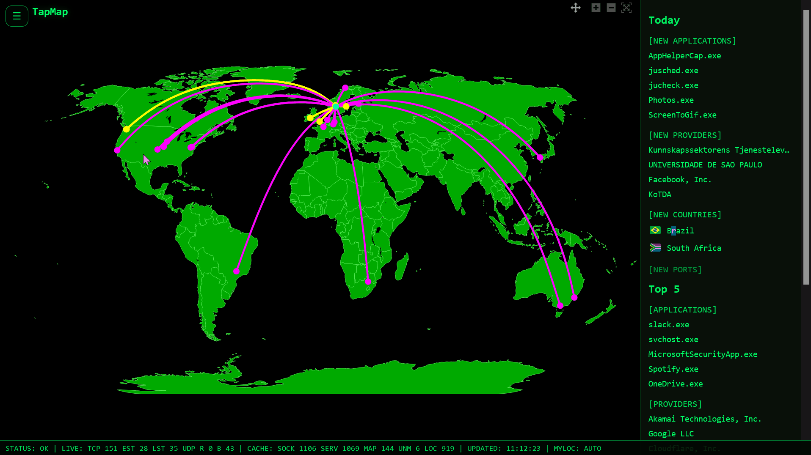
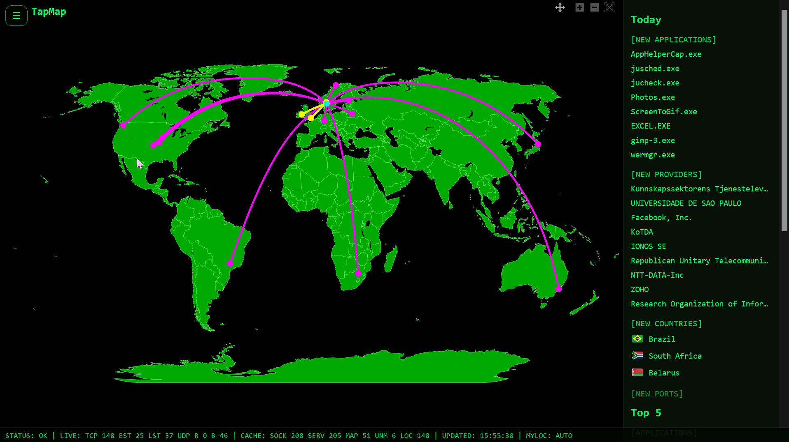
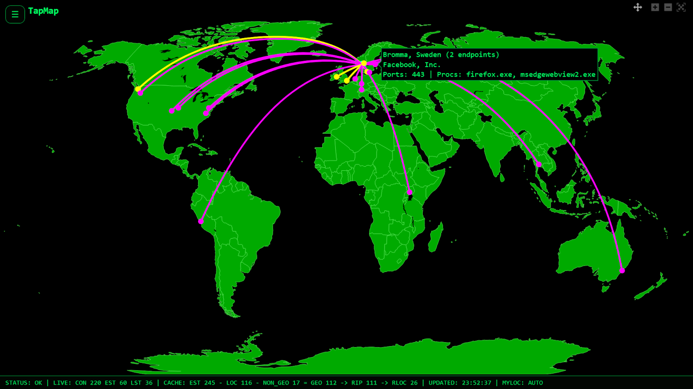
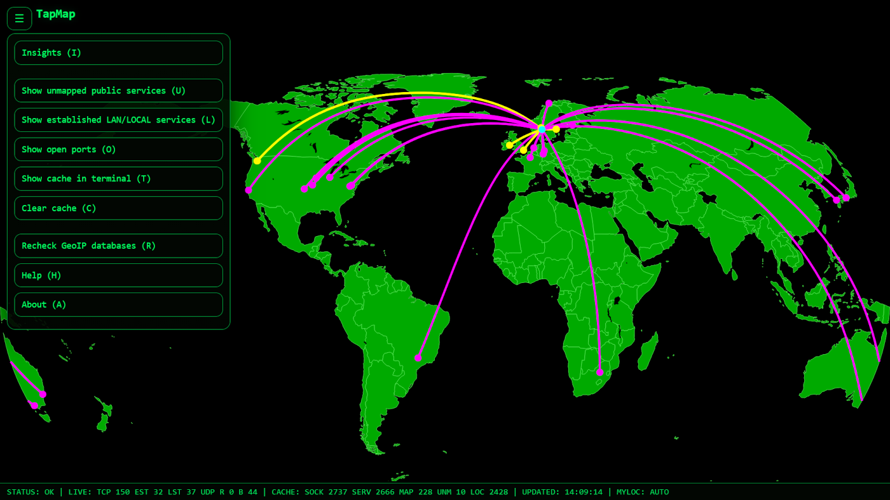
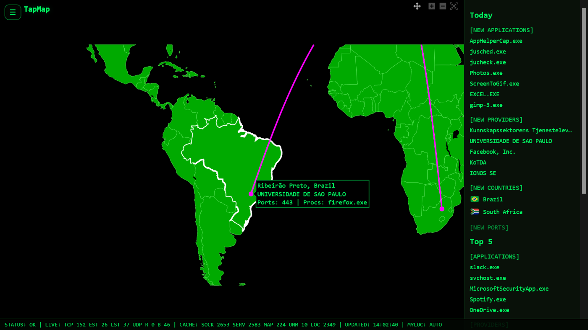
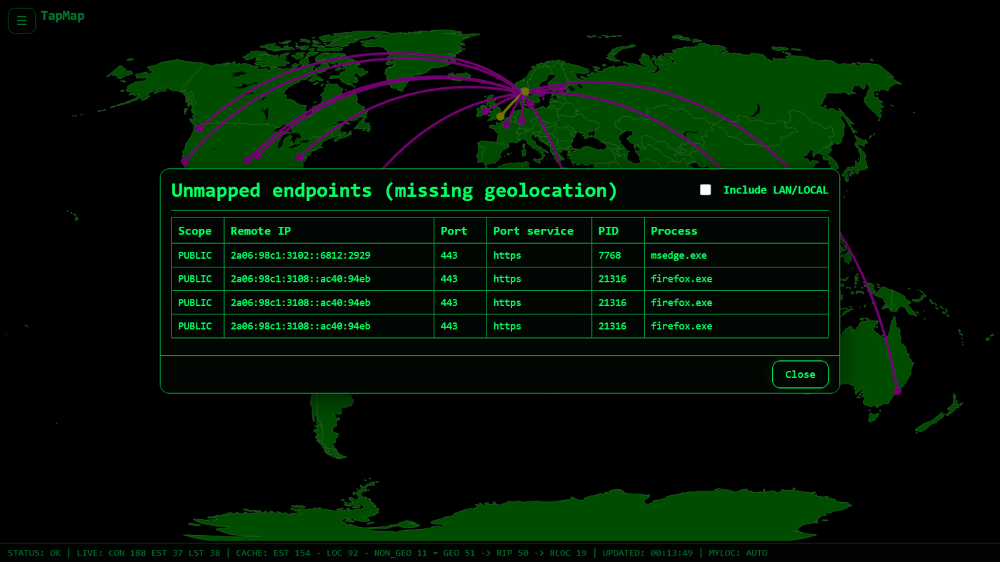
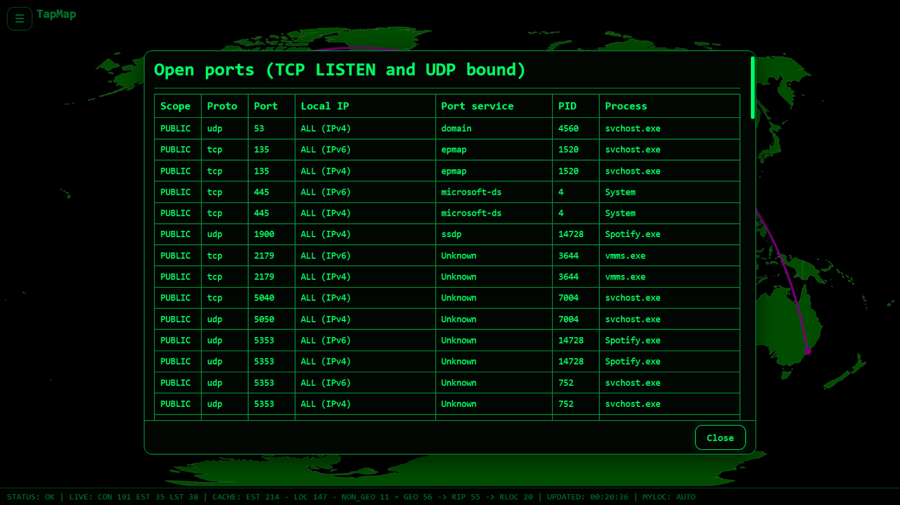
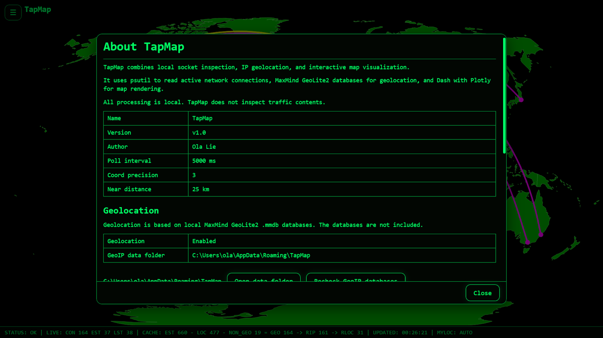

# TapMap

**See where your computer connects, and what stands out.**

TapMap shows what your computer normally connects to over the last 30 days and highlights what is unusual and what is most frequent.

Runs locally on Windows, Linux, and macOS. No telemetry. Docker supported on Linux.

TapMap inspects local socket data, enriches IP addresses with geolocation, and visualizes the locations on an interactive map.

TapMap uses:

- `psutil` (Windows and Linux) or `lsof` (macOS) to read active network connections  
- MaxMind GeoLite2 databases for IP geolocation  
- Dash and Plotly to render an interactive world map  

It is an awareness tool, not a firewall or a full security suite. 
It makes network activity visible and easy to explore.

---

## New: Insights

TapMap shows what your computer normally connects to over the last 30 days and highlights what is unusual and what is most frequent.

- New apps, services (ASN), countries, and ports  
- Frequent activity (Top 5)  
- Click countries to zoom and inspect on the map

This turns constant background traffic into something you can actually understand.

Insights are based on activity observed over time.  
To build a complete 30-day history, keep TapMap running while your system is in use. Running it at startup is recommended.

---

## Why TapMap

Your computer connects to many systems without you noticing.

TapMap makes this visible so you can:

- See where connections go  
- Notice when something new appears  
- Understand what is normal over time  
- Explore connections with hover and click

---

## What TapMap shows

- Services your computer connects to  
- Their approximate locations on a world map  
- Nearby locations highlighted visually  
- Insights panel showing new and frequent activity over time  
- Unmapped public services with missing geolocation  
- Established LAN and LOCAL services  
- Local open ports (TCP LISTEN and UDP bound)

All data is collected locally on your machine.

---

## How it works

TapMap follows a simple local pipeline:

    socket scan → IP extraction → GeoIP lookup → map rendering

---

## How to use

- Hover map markers for a summary  
- Click map markers for detailed information  
- Click countries in Insights to zoom to the location

---

## Documentation

Full documentation, including API reference and platform behavior notes:

https://olalie.github.io/tapmap/

---

## Download & run

Download the latest version from the  
[Releases page](https://github.com/olalie/tapmap/releases)

Available builds:

- Windows (zip)
- Linux (zip)
- macOS (zip)

Tested on Windows 11, Ubuntu, and macOS (Apple Silicon).

No installation required. Download, extract, and run.

Start TapMap:

    ./tapmap

On Windows, double-click `tapmap.exe`.

On Linux, you may need:

    chmod +x tapmap

Platform notes:

- Linux uses `xdg-open` for the **Open data folder** action
- macOS uses `open`

---

## Command line

    tapmap --help

    tapmap --version
    tapmap -v

---

## Windows SmartScreen

Windows may show a SmartScreen warning the first time you run TapMap.  
This is normal for new applications that are not digitally signed.

To start the program:

1. Click **More info**.
2. Click **Run anyway**.

---

## macOS security warning

macOS may block the app the first time you run TapMap.
This is normal for unsigned applications.

To start the program:

1. Try to open the app.
2. Open **System Settings → Privacy & Security**.
3. Click **Open anyway** for TapMap.

You may be asked to confirm once more.

Alternatively, you can remove the warning using Terminal:

    xattr -d com.apple.quarantine tapmap

---

## How it runs

TapMap runs locally and opens in your browser:

http://127.0.0.1:8050/

If it does not open automatically, enter the address manually.

The default port is defined by `SERVER_PORT` in `config.py`.

The port can be overridden using the environment variable `TAPMAP_PORT`.

Examples:

Linux / macOS:

    TAPMAP_PORT=8060 python tapmap.py

PowerShell:

    $env:TAPMAP_PORT="8060"
    python tapmap.py

---

## GeoIP databases (required for map locations)

TapMap uses local MaxMind GeoLite2 databases for geolocation.  
The databases are not included in the download.

TapMap works without these files, but map locations will not be displayed.

Required files:

- GeoLite2-City.mmdb  
- GeoLite2-ASN.mmdb  

Download (free, account required):
    https://dev.maxmind.com/geoip/geolite2-free-geolocation-data

After downloading:

1. Start TapMap.
2. Follow the setup window to open the **data folder**.
3. Copy the `.mmdb` files into that folder.
4. Click **Recheck GeoIP databases**.

Update recommendation: download updated databases regularly, for example monthly.  
Redistribution is subject to the MaxMind license terms.

---

## Interface

### Main view

### Actions menu

### Insights panel

### Unmapped services

### Open ports

### About

---

## Keyboard controls

| Key | Action |
|-----|--------|
| I   | Toggle Insights panel |
| U   | Unmapped public services |
| L   | Established LAN/LOCAL services |
| O   | Open ports |
| T   | Show cache in terminal |
| C   | Clear cache |
| R   | Recheck GeoIP databases |
| H   | Help |
| A   | About |
| ESC | Close window |

---

## Privacy

- TapMap runs locally.  
- No connection data is sent anywhere.
- Geolocation uses local MaxMind databases.
- If `MY_LOCATION = "auto"`, TapMap makes a small request to detect your public IP.
- To detect offline status, TapMap performs short connection checks to 1.1.1.1 and 8.8.8.8.

---

## Configuration

TapMap reads settings from `config.py`.

Common settings:

- `SERVER_PORT`  
- `MY_LOCATION`  
- `POLL_INTERVAL_MS`  
- `COORD_PRECISION`  
- `ZOOM_NEAR_KM`

`SERVER_PORT` defines the default port used by the local Dash server.

The port can be overridden at runtime using the environment variable `TAPMAP_PORT`.

---

## Build from source

Requirements:

- Python 3.10+

Create virtual environment:

    python -m venv .venv

Activate:

    source .venv/bin/activate   (Linux/macOS)
    .venv\Scripts\activate      (Windows)

Install dependencies:

    pip install -r requirements.txt

Run:

    python tapmap.py

Alternatively:

    python -m tapmap

Run tests:

    pytest

---

### Build executable (optional)

Build a standalone executable using PyInstaller:

    python tools/build.py

Output:

- Linux/macOS: dist/tapmap
- Windows: dist/tapmap.exe

Run:

    ./dist/tapmap      (Linux/macOS)
    dist\tapmap.exe    (Windows)

Note:

The executable must be built on the target operating system.

---

## Docker (Linux)

TapMap can run in Docker on Linux hosts.

### Requirements

- Linux host  
- Docker installed  
- GeoLite2 `.mmdb` files  

### Setup

Place the GeoLite2 database files in:

    docker-data/

### Run

    docker compose -f compose.linux.yaml up --build

The server binds to 0.0.0.0 by default in Docker.

Override in compose if needed:

    TAPMAP_HOST: "127.0.0.1"

Open in browser on the host:

http://127.0.0.1:8050

If you access the app from another machine, use the host IP address instead.

### Notes

- Docker provides full TCP and UDP socket data  
- Process information may be unavailable in Docker mode, depending on host security policies  
- Requires Linux host (not supported on Docker Desktop for Windows or macOS)

Process visibility in Docker depends on host security policies.

On Ubuntu with the default Docker AppArmor profile (`docker-default`), `SYS_PTRACE` alone was not sufficient.

In this setup, process names became available with:

    --cap-add=SYS_PTRACE
    --security-opt apparmor=unconfined

Behavior may vary across systems.

---

## Docker Hub

TapMap can run directly from Docker Hub without cloning the repository.

### Setup

Create a local data folder:

    mkdir -p ~/tapmap-data

Place the GeoLite2 database files in that folder:

- GeoLite2-City.mmdb
- GeoLite2-ASN.mmdb

### Run

    docker run --rm \
      --network host \
      --pid host \
      -v ~/tapmap-data:/data \
      -e TAPMAP_IN_DOCKER=1 \
      olalie/tapmap:latest

The server binds to 0.0.0.0 by default in Docker.

To override the bind address:

    -e TAPMAP_HOST=127.0.0.1

Open in browser on the host:

http://127.0.0.1:8050

If you access the app from another machine, use the host IP address instead.

### Notes

- The mounted folder is used as the container data directory (`/data`)  
- The host folder name can be chosen freely  
- Process information may be unavailable in Docker mode, depending on host security policies  
- Requires Linux host (not supported on Docker Desktop for Windows or macOS)

---

## Support the project

TapMap is free and open source.

If you find it useful, consider supporting the project:

- https://www.buymeacoffee.com/olalie  
- https://www.paypal.com/donate/?hosted_button_id=ELLXBK9BY8EDU  

You can also give the project a star on GitHub.

---

## License

MIT License

---

## Acknowledgements

Thanks to @TechnVision for raising the configurable port use case.  
Thanks to @desrod for suggesting a solution for configurable port support.  
Thanks to @hugalafutro for suggesting optional SYS_PTRACE support for process visibility on Linux.
