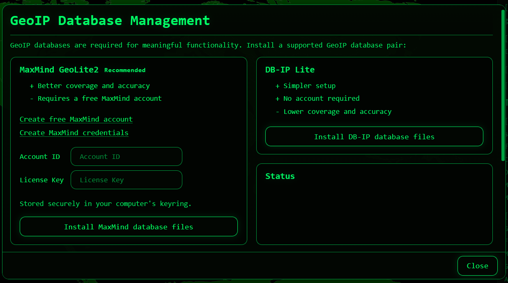
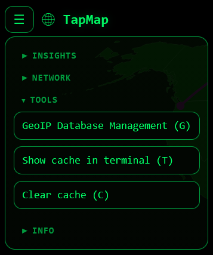

# GeoIP Database Management

## Overview

TapMap requires GeoIP databases to display geographic locations on the map.

On startup, TapMap checks the application data folder for supported GeoIP databases.

If no supported databases are found, GeoIP Database Management opens automatically and guides you through the installation process.

After databases have been installed, GeoIP Database Management can be opened at any time from the Tools menu or by pressing **G**.

TapMap supports:

- MaxMind GeoLite2 (recommended)
- DB-IP Lite

## First-time installation

On startup, TapMap checks for supported GeoIP databases.

If no supported databases are found, GeoIP Database Management opens automatically and guides you through the installation process.



Users can choose between:

- MaxMind GeoLite2
- DB-IP Lite

#### MaxMind GeoLite2

Recommended provider.

Benefits:

- Better coverage and accuracy

Requirements:

- Free MaxMind account
- Account ID
- License Key

#### DB-IP Lite

Alternative provider to MaxMind GeoLite2.

Benefits:

- Simpler setup
- No account required

Limitations:

- Lower coverage and accuracy

## Manual installation

If you prefer not to install databases through GeoIP Database Management, you can install them manually.

#### Download the databases

##### MaxMind GeoLite2

Download:

- GeoLite2 City (GeoIP2 Binary / .mmdb)
- GeoLite2 ASN (GeoIP2 Binary / .mmdb)

https://dev.maxmind.com/geoip/geolite2-free-geolocation-data

Do not download the CSV versions.

MaxMind distributes the databases as compressed archives. Extract the archives before copying the `.mmdb` files into the database folder.

Required filenames:

```text
GeoLite2-City.mmdb
GeoLite2-ASN.mmdb
```

##### DB-IP Lite

Download:

- DB-IP City Lite
- DB-IP ASN Lite

https://db-ip.com/db/lite.php

DB-IP distributes the databases as compressed `.gz` files.

Examples:

```text
dbip-city-lite-2026-06.mmdb.gz
dbip-asn-lite-2026-06.mmdb.gz
```

Extract the files before copying them to the database folder.

After extraction, rename the files to:

```text
DBIP-City.mmdb
DBIP-ASN.mmdb
```

#### Install the databases

1. Click **Open data folder**.
2. Copy the database files into the data folder.
3. Click **Recheck databases**.

TapMap detects the databases and updates its database status.

A restart is not normally required.

## Opening GeoIP Database Management

Open GeoIP Database Management from the Tools menu or press **G**.



GeoIP Database Management can be used to:

- Install databases
- Update databases
- Recheck database status
- Open the database folder

## Updating databases

#### Automatic updates

When databases are installed, GeoIP Database Management can check for newer versions.

1. Open GeoIP Database Management.
2. Click **Update databases**.

TapMap checks for newer database versions and installs updates when available.

#### Manual updates

If you update database files manually, replace the existing files in the database folder with newer versions.

On some systems, database files may be locked while TapMap is running.

If existing database files cannot be replaced:

1. Close TapMap.
2. Replace the database files.
3. Start TapMap again.

If the new databases are not detected immediately, click **Recheck databases**.

## Rechecking databases

Use **Recheck databases** to:

- Detect manually added database files
- Refresh database status information

Recheck is primarily intended for manual database installation and troubleshooting.

## Switching provider

To switch provider:

1. Open **GeoIP Database Management**.
2. Click **Open data folder**.
3. Close TapMap.
4. Remove the current database files.
5. Start TapMap.

If no supported databases are found, GeoIP Database Management opens automatically and displays the installation workflow.

From there you can install either:

- MaxMind GeoLite2
- DB-IP Lite

If you choose MaxMind GeoLite2, you may enter or update your MaxMind credentials before installation.

## Credential storage

On desktop installations, MaxMind credentials are stored securely in the operating system keyring.

In Docker, credentials are stored in the Docker data directory for future updates.

Credentials are not stored in TapMap configuration files.

The installation workflow is the recommended way to create or update credentials.

Desktop installations use:

```text
Service: tapmap_geolite2

Username: account_id
Username: license_key
```

## Docker

When running in Docker, the database folder is mapped from the host to `/data` inside the container.

See Environment Variables for Docker-specific configuration options.

## Troubleshooting

#### Missing geolocation

If services appear under **Unmapped public services (missing geolocation)**, open **GeoIP Database Management** and verify that a GeoIP provider is installed and detected.

If no databases are installed, follow the installation workflow.

#### Databases not detected

Click **Recheck databases**.

If database files were copied manually while TapMap was running, click **Recheck databases**.

If database files were copied manually while TapMap was not running, restart TapMap.

#### Installation or update failed

Verify that:

- Internet access is available.
- MaxMind credentials are valid (MaxMind only).
- The database folder is writable.

Review the status message shown in **GeoIP Database Management** for additional details.
